# PicInfo: Caption Generation for Images

## Abstract

Image captioning involves generating human3
readable descriptions or sentences that accurately depict
the content of an image. In this study, we propose an
image caption generation utilizing two NLP techniques
Greedy Search(argmax) and Beam Search.
Convolutional Neural Networks (CNN), specifically the
InceptionV3 model is used for image feature extraction.
The combination of CV and NLP techniques are applied
to a Facebook public multimodal dataset (PMD)
comprising 566,747 training images and 25,010 test
images. From this dataset, 16,000 training images are
utilized for feature extraction and training the Natural
Language Processing (NLP) model, while 1,600 test
images are employed for feature extraction and testing
the NLP model. The image caption generation
techniques (Greedy Search and Beam Search) are
compared based on BLEU (Bilingual Evaluation
Understudy), ROUGE-L and METEOR score. Through
comprehensive experimentation and evaluation, this
study aims to provide insights into the comparative
performance of different caption generation approaches.

## Model Architecture
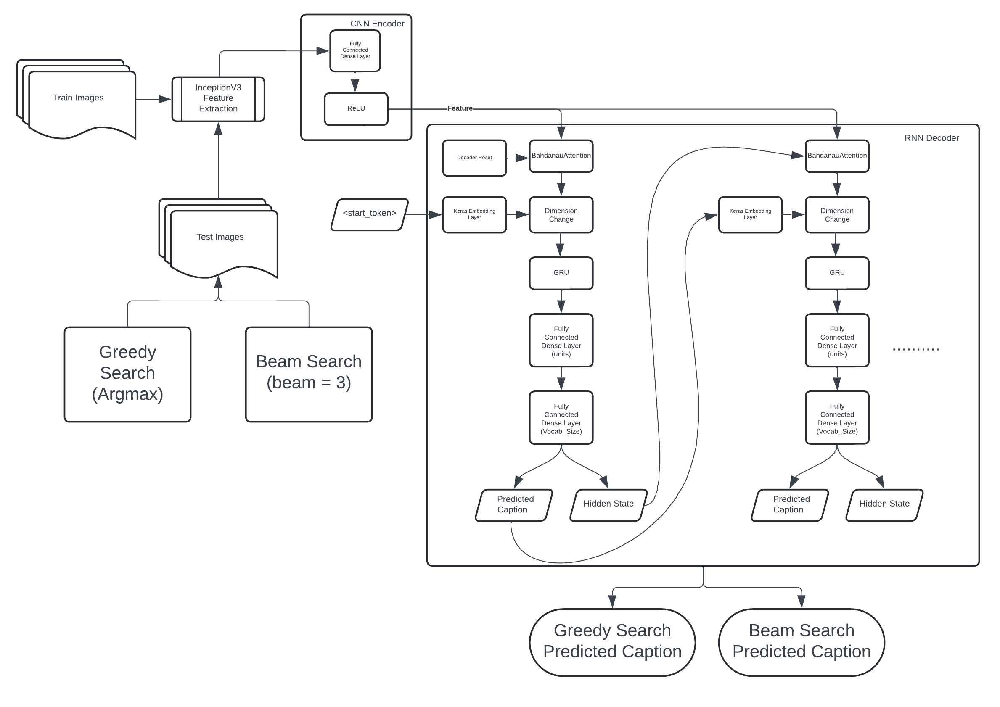

```python
! python -m pip uninstall tensorflow -y
! python -m pip uninstall keras -y
! pip install tensorflow==2.15.0
! pip install keras==2.15.0
! pip install tensorflow-addons==0.23.0
! pip install nltk==3.8.1
! pip install datasets
! pip install matplotlib scikit-learn
! pip install -U accelerate
! pip install huggingface_hub
```

    Found existing installation: tensorflow 2.15.0
    Uninstalling tensorflow-2.15.0:
      Successfully uninstalled tensorflow-2.15.0
    Found existing installation: keras 3.2.1
    Uninstalling keras-3.2.1:
      Successfully uninstalled keras-3.2.1
    Collecting tensorflow==2.15.0
      Downloading tensorflow-2.15.0-cp310-cp310-manylinux_2_17_x86_64.manylinux2014_x86_64.whl.metadata (4.4 kB)
    Requirement already satisfied: absl-py>=1.0.0 in /opt/conda/lib/python3.10/site-packages (from tensorflow==2.15.0) (1.4.0)
    Requirement already satisfied: astunparse>=1.6.0 in /opt/conda/lib/python3.10/site-packages (from tensorflow==2.15.0) (1.6.3)
    Requirement already satisfied: flatbuffers>=23.5.26 in /opt/conda/lib/python3.10/site-packages (from tensorflow==2.15.0) (23.5.26)
    Requirement already satisfied: gast!=0.5.0,!=0.5.1,!=0.5.2,>=0.2.1 in /opt/conda/lib/python3.10/site-packages (from tensorflow==2.15.0) (0.5.4)
    Requirement already satisfied: google-pasta>=0.1.1 in /opt/conda/lib/python3.10/site-packages (from tensorflow==2.15.0) (0.2.0)
    Requirement already satisfied: h5py>=2.9.0 in /opt/conda/lib/python3.10/site-packages (from tensorflow==2.15.0) (3.10.0)
    Requirement already satisfied: libclang>=13.0.0 in /opt/conda/lib/python3.10/site-packages (from tensorflow==2.15.0) (16.0.6)
    Requirement already satisfied: ml-dtypes~=0.2.0 in /opt/conda/lib/python3.10/site-packages (from tensorflow==2.15.0) (0.2.0)
    Requirement already satisfied: numpy<2.0.0,>=1.23.5 in /opt/conda/lib/python3.10/site-packages (from tensorflow==2.15.0) (1.26.4)
    Requirement already satisfied: opt-einsum>=2.3.2 in /opt/conda/lib/python3.10/site-packages (from tensorflow==2.15.0) (3.3.0)
    Requirement already satisfied: packaging in /opt/conda/lib/python3.10/site-packages (from tensorflow==2.15.0) (21.3)
    Requirement already satisfied: protobuf!=4.21.0,!=4.21.1,!=4.21.2,!=4.21.3,!=4.21.4,!=4.21.5,<5.0.0dev,>=3.20.3 in /opt/conda/lib/python3.10/site-packages (from tensorflow==2.15.0) (3.20.3)
    Requirement already satisfied: setuptools in /opt/conda/lib/python3.10/site-packages (from tensorflow==2.15.0) (69.0.3)
    Requirement already satisfied: six>=1.12.0 in /opt/conda/lib/python3.10/site-packages (from tensorflow==2.15.0) (1.16.0)
    Requirement already satisfied: termcolor>=1.1.0 in /opt/conda/lib/python3.10/site-packages (from tensorflow==2.15.0) (2.4.0)
    Requirement already satisfied: typing-extensions>=3.6.6 in /opt/conda/lib/python3.10/site-packages (from tensorflow==2.15.0) (4.9.0)
    Requirement already satisfied: wrapt<1.15,>=1.11.0 in /opt/conda/lib/python3.10/site-packages (from tensorflow==2.15.0) (1.14.1)
    Requirement already satisfied: tensorflow-io-gcs-filesystem>=0.23.1 in /opt/conda/lib/python3.10/site-packages (from tensorflow==2.15.0) (0.35.0)
    Requirement already satisfied: grpcio<2.0,>=1.24.3 in /opt/conda/lib/python3.10/site-packages (from tensorflow==2.15.0) (1.51.1)
    Requirement already satisfied: tensorboard<2.16,>=2.15 in /opt/conda/lib/python3.10/site-packages (from tensorflow==2.15.0) (2.15.1)
    Requirement already satisfied: tensorflow-estimator<2.16,>=2.15.0 in /opt/conda/lib/python3.10/site-packages (from tensorflow==2.15.0) (2.15.0)
    Collecting keras<2.16,>=2.15.0 (from tensorflow==2.15.0)
      Downloading keras-2.15.0-py3-none-any.whl.metadata (2.4 kB)
    Requirement already satisfied: wheel<1.0,>=0.23.0 in /opt/conda/lib/python3.10/site-packages (from astunparse>=1.6.0->tensorflow==2.15.0) (0.42.0)
    Requirement already satisfied: google-auth<3,>=1.6.3 in /opt/conda/lib/python3.10/site-packages (from tensorboard<2.16,>=2.15->tensorflow==2.15.0) (2.26.1)
    Requirement already satisfied: google-auth-oauthlib<2,>=0.5 in /opt/conda/lib/python3.10/site-packages (from tensorboard<2.16,>=2.15->tensorflow==2.15.0) (1.2.0)
    Requirement already satisfied: markdown>=2.6.8 in /opt/conda/lib/python3.10/site-packages (from tensorboard<2.16,>=2.15->tensorflow==2.15.0) (3.5.2)
    Requirement already satisfied: requests<3,>=2.21.0 in /opt/conda/lib/python3.10/site-packages (from tensorboard<2.16,>=2.15->tensorflow==2.15.0) (2.31.0)
    Requirement already satisfied: tensorboard-data-server<0.8.0,>=0.7.0 in /opt/conda/lib/python3.10/site-packages (from tensorboard<2.16,>=2.15->tensorflow==2.15.0) (0.7.2)
    Requirement already satisfied: werkzeug>=1.0.1 in /opt/conda/lib/python3.10/site-packages (from tensorboard<2.16,>=2.15->tensorflow==2.15.0) (3.0.2)
    Requirement already satisfied: pyparsing!=3.0.5,>=2.0.2 in /opt/conda/lib/python3.10/site-packages (from packaging->tensorflow==2.15.0) (3.1.1)
    Requirement already satisfied: cachetools<6.0,>=2.0.0 in /opt/conda/lib/python3.10/site-packages (from google-auth<3,>=1.6.3->tensorboard<2.16,>=2.15->tensorflow==2.15.0) (4.2.4)
    Requirement already satisfied: pyasn1-modules>=0.2.1 in /opt/conda/lib/python3.10/site-packages (from google-auth<3,>=1.6.3->tensorboard<2.16,>=2.15->tensorflow==2.15.0) (0.3.0)
    Requirement already satisfied: rsa<5,>=3.1.4 in /opt/conda/lib/python3.10/site-packages (from google-auth<3,>=1.6.3->tensorboard<2.16,>=2.15->tensorflow==2.15.0) (4.9)
    Requirement already satisfied: requests-oauthlib>=0.7.0 in /opt/conda/lib/python3.10/site-packages (from google-auth-oauthlib<2,>=0.5->tensorboard<2.16,>=2.15->tensorflow==2.15.0) (1.3.1)
    Requirement already satisfied: charset-normalizer<4,>=2 in /opt/conda/lib/python3.10/site-packages (from requests<3,>=2.21.0->tensorboard<2.16,>=2.15->tensorflow==2.15.0) (3.3.2)
    Requirement already satisfied: idna<4,>=2.5 in /opt/conda/lib/python3.10/site-packages (from requests<3,>=2.21.0->tensorboard<2.16,>=2.15->tensorflow==2.15.0) (3.6)
    Requirement already satisfied: urllib3<3,>=1.21.1 in /opt/conda/lib/python3.10/site-packages (from requests<3,>=2.21.0->tensorboard<2.16,>=2.15->tensorflow==2.15.0) (1.26.18)
    Requirement already satisfied: certifi>=2017.4.17 in /opt/conda/lib/python3.10/site-packages (from requests<3,>=2.21.0->tensorboard<2.16,>=2.15->tensorflow==2.15.0) (2024.2.2)
    Requirement already satisfied: MarkupSafe>=2.1.1 in /opt/conda/lib/python3.10/site-packages (from werkzeug>=1.0.1->tensorboard<2.16,>=2.15->tensorflow==2.15.0) (2.1.3)
    Requirement already satisfied: pyasn1<0.6.0,>=0.4.6 in /opt/conda/lib/python3.10/site-packages (from pyasn1-modules>=0.2.1->google-auth<3,>=1.6.3->tensorboard<2.16,>=2.15->tensorflow==2.15.0) (0.5.1)
    Requirement already satisfied: oauthlib>=3.0.0 in /opt/conda/lib/python3.10/site-packages (from requests-oauthlib>=0.7.0->google-auth-oauthlib<2,>=0.5->tensorboard<2.16,>=2.15->tensorflow==2.15.0) (3.2.2)
    Downloading tensorflow-2.15.0-cp310-cp310-manylinux_2_17_x86_64.manylinux2014_x86_64.whl (475.2 MB)
       ━━━━━━━━━━━━━━━━━━━━━━━━━━━━━━━━━━━━━━━━ 475.2/475.2 MB 3.4 MB/s eta 0:00:00:00:0100:01
    [?25hDownloading keras-2.15.0-py3-none-any.whl (1.7 MB)
       ━━━━━━━━━━━━━━━━━━━━━━━━━━━━━━━━━━━━━━━━ 1.7/1.7 MB 47.8 MB/s eta 0:00:00:00:01
    [?25hInstalling collected packages: keras, tensorflow
    ERROR: pip's dependency resolver does not currently take into account all the packages that are installed. This behaviour is the source of the following dependency conflicts.
    tensorflow-decision-forests 1.8.1 requires wurlitzer, which is not installed.
    Successfully installed keras-2.15.0 tensorflow-2.15.0
    Requirement already satisfied: keras==2.15.0 in /opt/conda/lib/python3.10/site-packages (2.15.0)
    Collecting tensorflow-addons==0.23.0
      Downloading tensorflow_addons-0.23.0-cp310-cp310-manylinux_2_17_x86_64.manylinux2014_x86_64.whl.metadata (1.8 kB)
    Requirement already satisfied: packaging in /opt/conda/lib/python3.10/site-packages (from tensorflow-addons==0.23.0) (21.3)
    Collecting typeguard<3.0.0,>=2.7 (from tensorflow-addons==0.23.0)
      Downloading typeguard-2.13.3-py3-none-any.whl.metadata (3.6 kB)
    Requirement already satisfied: pyparsing!=3.0.5,>=2.0.2 in /opt/conda/lib/python3.10/site-packages (from packaging->tensorflow-addons==0.23.0) (3.1.1)
    Downloading tensorflow_addons-0.23.0-cp310-cp310-manylinux_2_17_x86_64.manylinux2014_x86_64.whl (611 kB)
       ━━━━━━━━━━━━━━━━━━━━━━━━━━━━━━━━━━━━━━━━ 611.8/611.8 kB 16.6 MB/s eta 0:00:0000:01
    [?25hDownloading typeguard-2.13.3-py3-none-any.whl (17 kB)
    Installing collected packages: typeguard, tensorflow-addons
      Attempting uninstall: typeguard
        Found existing installation: typeguard 4.1.5
        Uninstalling typeguard-4.1.5:
          Successfully uninstalled typeguard-4.1.5
    ERROR: pip's dependency resolver does not currently take into account all the packages that are installed. This behaviour is the source of the following dependency conflicts.
    ydata-profiling 4.6.4 requires numpy<1.26,>=1.16.0, but you have numpy 1.26.4 which is incompatible.
    ydata-profiling 4.6.4 requires typeguard<5,>=4.1.2, but you have typeguard 2.13.3 which is incompatible.
    Successfully installed tensorflow-addons-0.23.0 typeguard-2.13.3
    Requirement already satisfied: datasets in /opt/conda/lib/python3.10/site-packages (2.18.0)
    Requirement already satisfied: filelock in /opt/conda/lib/python3.10/site-packages (from datasets) (3.13.1)
    Requirement already satisfied: numpy>=1.17 in /opt/conda/lib/python3.10/site-packages (from datasets) (1.26.4)
    Requirement already satisfied: pyarrow>=12.0.0 in /opt/conda/lib/python3.10/site-packages (from datasets) (15.0.2)
    Requirement already satisfied: pyarrow-hotfix in /opt/conda/lib/python3.10/site-packages (from datasets) (0.6)
    Requirement already satisfied: dill<0.3.9,>=0.3.0 in /opt/conda/lib/python3.10/site-packages (from datasets) (0.3.8)
    Requirement already satisfied: pandas in /opt/conda/lib/python3.10/site-packages (from datasets) (2.1.4)
    Requirement already satisfied: requests>=2.19.0 in /opt/conda/lib/python3.10/site-packages (from datasets) (2.31.0)
    Requirement already satisfied: tqdm>=4.62.1 in /opt/conda/lib/python3.10/site-packages (from datasets) (4.66.1)
    Requirement already satisfied: xxhash in /opt/conda/lib/python3.10/site-packages (from datasets) (3.4.1)
    Requirement already satisfied: multiprocess in /opt/conda/lib/python3.10/site-packages (from datasets) (0.70.16)
    Requirement already satisfied: fsspec<=2024.2.0,>=2023.1.0 in /opt/conda/lib/python3.10/site-packages (from fsspec[http]<=2024.2.0,>=2023.1.0->datasets) (2024.2.0)
    Requirement already satisfied: aiohttp in /opt/conda/lib/python3.10/site-packages (from datasets) (3.9.1)
    Requirement already satisfied: huggingface-hub>=0.19.4 in /opt/conda/lib/python3.10/site-packages (from datasets) (0.22.2)
    Requirement already satisfied: packaging in /opt/conda/lib/python3.10/site-packages (from datasets) (21.3)
    Requirement already satisfied: pyyaml>=5.1 in /opt/conda/lib/python3.10/site-packages (from datasets) (6.0.1)
    Requirement already satisfied: attrs>=17.3.0 in /opt/conda/lib/python3.10/site-packages (from aiohttp->datasets) (23.2.0)
    Requirement already satisfied: multidict<7.0,>=4.5 in /opt/conda/lib/python3.10/site-packages (from aiohttp->datasets) (6.0.4)
    Requirement already satisfied: yarl<2.0,>=1.0 in /opt/conda/lib/python3.10/site-packages (from aiohttp->datasets) (1.9.3)
    Requirement already satisfied: frozenlist>=1.1.1 in /opt/conda/lib/python3.10/site-packages (from aiohttp->datasets) (1.4.1)
    Requirement already satisfied: aiosignal>=1.1.2 in /opt/conda/lib/python3.10/site-packages (from aiohttp->datasets) (1.3.1)
    Requirement already satisfied: async-timeout<5.0,>=4.0 in /opt/conda/lib/python3.10/site-packages (from aiohttp->datasets) (4.0.3)
    Requirement already satisfied: typing-extensions>=3.7.4.3 in /opt/conda/lib/python3.10/site-packages (from huggingface-hub>=0.19.4->datasets) (4.9.0)
    Requirement already satisfied: pyparsing!=3.0.5,>=2.0.2 in /opt/conda/lib/python3.10/site-packages (from packaging->datasets) (3.1.1)
    Requirement already satisfied: charset-normalizer<4,>=2 in /opt/conda/lib/python3.10/site-packages (from requests>=2.19.0->datasets) (3.3.2)
    Requirement already satisfied: idna<4,>=2.5 in /opt/conda/lib/python3.10/site-packages (from requests>=2.19.0->datasets) (3.6)
    Requirement already satisfied: urllib3<3,>=1.21.1 in /opt/conda/lib/python3.10/site-packages (from requests>=2.19.0->datasets) (1.26.18)
    Requirement already satisfied: certifi>=2017.4.17 in /opt/conda/lib/python3.10/site-packages (from requests>=2.19.0->datasets) (2024.2.2)
    Requirement already satisfied: python-dateutil>=2.8.2 in /opt/conda/lib/python3.10/site-packages (from pandas->datasets) (2.9.0.post0)
    Requirement already satisfied: pytz>=2020.1 in /opt/conda/lib/python3.10/site-packages (from pandas->datasets) (2023.3.post1)
    Requirement already satisfied: tzdata>=2022.1 in /opt/conda/lib/python3.10/site-packages (from pandas->datasets) (2023.4)
    Requirement already satisfied: six>=1.5 in /opt/conda/lib/python3.10/site-packages (from python-dateutil>=2.8.2->pandas->datasets) (1.16.0)
    Requirement already satisfied: matplotlib in /opt/conda/lib/python3.10/site-packages (3.7.5)
    Requirement already satisfied: scikit-learn in /opt/conda/lib/python3.10/site-packages (1.2.2)
    Requirement already satisfied: contourpy>=1.0.1 in /opt/conda/lib/python3.10/site-packages (from matplotlib) (1.2.0)
    Requirement already satisfied: cycler>=0.10 in /opt/conda/lib/python3.10/site-packages (from matplotlib) (0.12.1)
    Requirement already satisfied: fonttools>=4.22.0 in /opt/conda/lib/python3.10/site-packages (from matplotlib) (4.47.0)
    Requirement already satisfied: kiwisolver>=1.0.1 in /opt/conda/lib/python3.10/site-packages (from matplotlib) (1.4.5)
    Requirement already satisfied: numpy<2,>=1.20 in /opt/conda/lib/python3.10/site-packages (from matplotlib) (1.26.4)
    Requirement already satisfied: packaging>=20.0 in /opt/conda/lib/python3.10/site-packages (from matplotlib) (21.3)
    Requirement already satisfied: pillow>=6.2.0 in /opt/conda/lib/python3.10/site-packages (from matplotlib) (9.5.0)
    Requirement already satisfied: pyparsing>=2.3.1 in /opt/conda/lib/python3.10/site-packages (from matplotlib) (3.1.1)
    Requirement already satisfied: python-dateutil>=2.7 in /opt/conda/lib/python3.10/site-packages (from matplotlib) (2.9.0.post0)
    Requirement already satisfied: scipy>=1.3.2 in /opt/conda/lib/python3.10/site-packages (from scikit-learn) (1.11.4)
    Requirement already satisfied: joblib>=1.1.1 in /opt/conda/lib/python3.10/site-packages (from scikit-learn) (1.4.0)
    Requirement already satisfied: threadpoolctl>=2.0.0 in /opt/conda/lib/python3.10/site-packages (from scikit-learn) (3.2.0)
    Requirement already satisfied: six>=1.5 in /opt/conda/lib/python3.10/site-packages (from python-dateutil>=2.7->matplotlib) (1.16.0)
    Requirement already satisfied: accelerate in /opt/conda/lib/python3.10/site-packages (0.29.3)
    Requirement already satisfied: numpy>=1.17 in /opt/conda/lib/python3.10/site-packages (from accelerate) (1.26.4)
    Requirement already satisfied: packaging>=20.0 in /opt/conda/lib/python3.10/site-packages (from accelerate) (21.3)
    Requirement already satisfied: psutil in /opt/conda/lib/python3.10/site-packages (from accelerate) (5.9.3)
    Requirement already satisfied: pyyaml in /opt/conda/lib/python3.10/site-packages (from accelerate) (6.0.1)
    Requirement already satisfied: torch>=1.10.0 in /opt/conda/lib/python3.10/site-packages (from accelerate) (2.1.2)
    Requirement already satisfied: huggingface-hub in /opt/conda/lib/python3.10/site-packages (from accelerate) (0.22.2)
    Requirement already satisfied: safetensors>=0.3.1 in /opt/conda/lib/python3.10/site-packages (from accelerate) (0.4.3)
    Requirement already satisfied: pyparsing!=3.0.5,>=2.0.2 in /opt/conda/lib/python3.10/site-packages (from packaging>=20.0->accelerate) (3.1.1)
    Requirement already satisfied: filelock in /opt/conda/lib/python3.10/site-packages (from torch>=1.10.0->accelerate) (3.13.1)
    Requirement already satisfied: typing-extensions in /opt/conda/lib/python3.10/site-packages (from torch>=1.10.0->accelerate) (4.9.0)
    Requirement already satisfied: sympy in /opt/conda/lib/python3.10/site-packages (from torch>=1.10.0->accelerate) (1.12)
    Requirement already satisfied: networkx in /opt/conda/lib/python3.10/site-packages (from torch>=1.10.0->accelerate) (3.2.1)
    Requirement already satisfied: jinja2 in /opt/conda/lib/python3.10/site-packages (from torch>=1.10.0->accelerate) (3.1.2)
    Requirement already satisfied: fsspec in /opt/conda/lib/python3.10/site-packages (from torch>=1.10.0->accelerate) (2024.2.0)
    Requirement already satisfied: requests in /opt/conda/lib/python3.10/site-packages (from huggingface-hub->accelerate) (2.31.0)
    Requirement already satisfied: tqdm>=4.42.1 in /opt/conda/lib/python3.10/site-packages (from huggingface-hub->accelerate) (4.66.1)
    Requirement already satisfied: MarkupSafe>=2.0 in /opt/conda/lib/python3.10/site-packages (from jinja2->torch>=1.10.0->accelerate) (2.1.3)
    Requirement already satisfied: charset-normalizer<4,>=2 in /opt/conda/lib/python3.10/site-packages (from requests->huggingface-hub->accelerate) (3.3.2)
    Requirement already satisfied: idna<4,>=2.5 in /opt/conda/lib/python3.10/site-packages (from requests->huggingface-hub->accelerate) (3.6)
    Requirement already satisfied: urllib3<3,>=1.21.1 in /opt/conda/lib/python3.10/site-packages (from requests->huggingface-hub->accelerate) (1.26.18)
    Requirement already satisfied: certifi>=2017.4.17 in /opt/conda/lib/python3.10/site-packages (from requests->huggingface-hub->accelerate) (2024.2.2)
    Requirement already satisfied: mpmath>=0.19 in /opt/conda/lib/python3.10/site-packages (from sympy->torch>=1.10.0->accelerate) (1.3.0)
    Requirement already satisfied: huggingface_hub in /opt/conda/lib/python3.10/site-packages (0.22.2)
    Requirement already satisfied: filelock in /opt/conda/lib/python3.10/site-packages (from huggingface_hub) (3.13.1)
    Requirement already satisfied: fsspec>=2023.5.0 in /opt/conda/lib/python3.10/site-packages (from huggingface_hub) (2024.2.0)
    Requirement already satisfied: packaging>=20.9 in /opt/conda/lib/python3.10/site-packages (from huggingface_hub) (21.3)
    Requirement already satisfied: pyyaml>=5.1 in /opt/conda/lib/python3.10/site-packages (from huggingface_hub) (6.0.1)
    Requirement already satisfied: requests in /opt/conda/lib/python3.10/site-packages (from huggingface_hub) (2.31.0)
    Requirement already satisfied: tqdm>=4.42.1 in /opt/conda/lib/python3.10/site-packages (from huggingface_hub) (4.66.1)
    Requirement already satisfied: typing-extensions>=3.7.4.3 in /opt/conda/lib/python3.10/site-packages (from huggingface_hub) (4.9.0)
    Requirement already satisfied: pyparsing!=3.0.5,>=2.0.2 in /opt/conda/lib/python3.10/site-packages (from packaging>=20.9->huggingface_hub) (3.1.1)
    Requirement already satisfied: charset-normalizer<4,>=2 in /opt/conda/lib/python3.10/site-packages (from requests->huggingface_hub) (3.3.2)
    Requirement already satisfied: idna<4,>=2.5 in /opt/conda/lib/python3.10/site-packages (from requests->huggingface_hub) (3.6)
    Requirement already satisfied: urllib3<3,>=1.21.1 in /opt/conda/lib/python3.10/site-packages (from requests->huggingface_hub) (1.26.18)
    Requirement already satisfied: certifi>=2017.4.17 in /opt/conda/lib/python3.10/site-packages (from requests->huggingface_hub) (2024.2.2)


Login to Huggingface with api key


```python
from huggingface_hub import login
login()
```


    VBox(children=(HTML(value='<center>  device: 0, name: Tesla P100-PCIE-16GB, pci bus id: 0000:00:04.0, compute capability: 6.0
    
    On GPU:


    /opt/conda/lib/python3.10/site-packages/datasets/load.py:2516: FutureWarning: 'use_auth_token' was deprecated in favor of 'token' in version 2.14.0 and will be removed in 3.0.0.
    You can remove this warning by passing 'token=<use_auth_token>' instead.
      warnings.warn(


    Downloading builder script:   0%|          | 0.00/42.4k [00:00<?, ?B/s]


    Downloading readme:   0%|          | 0.00/19.8k [00:00<?, ?B/s]


    Downloading data:   0%|          | 0.00/36.7M [00:00<?, ?B/s]


    Downloading data:   0%|          | 0.00/13.5G [00:00<?, ?B/s]


    Downloading data:   0%|          | 0.00/6.65G [00:00<?, ?B/s]


    Generating train split: 0 examples [00:00, ? examples/s]


    Generating validation split: 0 examples [00:00, ? examples/s]


    Map:   0%|          | 0/566747 [00:00<?, ? examples/s]


    Map:   0%|          | 0/25010 [00:00<?, ? examples/s]


```python
# pmd = datasets.load_from_disk("pmd_dataset/")
pmd_train = pmd['train']
pmd_val = pmd['validation']
print(len(pmd_train))
print(len(pmd_val))
```

    566747
    25010


```python
for row in pmd_train.to_iterable_dataset():
    im = row['image']
    display(im)
    print("Caption: " + row['text'])
    metadata = json.loads(row['meta'])
    image_path = metadata['image_path']
    break
```


    

    


    Caption: A woman wearing a net on her head cutting a cake. 


```python
sess = tf.compat.v1.Session(config=tf.compat.v1.ConfigProto(log_device_placement=True))

# lists to store the captions and image_paths
all_train_img_captions = []
all_train_img_paths = []
all_val_img_captions = []
all_val_img_paths = []

def convert_dataset_to_list():
    for row in pmd_train.to_iterable_dataset():
        caption = '<start> ' + row['text'] + ' <end>'
        metadata = json.loads(row['meta'])
        image_path = metadata['image_path']
        all_train_img_captions.append(caption)
        all_train_img_paths.append(image_path)

    for row in pmd_val.to_iterable_dataset():
        caption = '<start> ' + row['text'] + ' <end>'
        metadata = json.loads(row['meta'])
        image_path = metadata['image_path']
        all_val_img_captions.append(caption)
        all_val_img_paths.append(image_path)


if tf.config.list_physical_devices("GPU"):
    print("On GPU:")
    with tf.device("/device:GPU:0"):
        convert_dataset_to_list()
else:
    print("On CPU:")
    convert_dataset_to_list()

# to set random states we shuffle the captions and image_paths together
train_img_captions, train_img_paths = shuffle(all_train_img_captions, all_train_img_paths, random_state=1)

# to set random states we shuffle the captions and image_paths together
val_img_captions, val_img_paths = shuffle(all_val_img_captions, all_val_img_paths, random_state=1)
print('\nTrain Dataset Sample')
print(train_img_captions[:5])
print(train_img_paths[:5])
print('\nTest Dataset Sample')
print(val_img_captions[:5])
print(val_img_paths[:5])
```

    Device mapping:
    /job:localhost/replica:0/task:0/device:GPU:0 -> device: 0, name: Tesla P100-PCIE-16GB, pci bus id: 0000:00:04.0, compute capability: 6.0
    
    On GPU:
    
    Train Dataset Sample
    ['<start> Several beautiful brown horses running through the meadow. <end>', '<start> Bed covered in stuffed animals with hello kitty bedding.  <end>', '<start> Two women carving up a pizza in a kitchen <end>', '<start> A very large building with a large clock on it . <end>', '<start> A red kite is being flown in a crowded park.  <end>']
    ['/root/.cache/huggingface/datasets/downloads/extracted/ca733e0e000fb2d7a09fbcc94dbfe7b5a30750681d0e965f8e0a23b1c2f98c75/val2014/COCO_val2014_000000549225.jpg', '/root/.cache/huggingface/datasets/downloads/extracted/2037d38f39f82fa2a51cedd39e325fcf7e806a356ea23774c16422f6a6c3514c/train2014/COCO_train2014_000000147392.jpg', '/root/.cache/huggingface/datasets/downloads/extracted/2037d38f39f82fa2a51cedd39e325fcf7e806a356ea23774c16422f6a6c3514c/train2014/COCO_train2014_000000517403.jpg', '/root/.cache/huggingface/datasets/downloads/extracted/ca733e0e000fb2d7a09fbcc94dbfe7b5a30750681d0e965f8e0a23b1c2f98c75/val2014/COCO_val2014_000000160308.jpg', '/root/.cache/huggingface/datasets/downloads/extracted/2037d38f39f82fa2a51cedd39e325fcf7e806a356ea23774c16422f6a6c3514c/train2014/COCO_train2014_000000066292.jpg']
    
    Test Dataset Sample
    ['<start> A young man riding a skateboard down a street. <end>', '<start> a close up of a cat on a desk near a sandwich  <end>', '<start> A silver hippy van and a bus for vegans. <end>', '<start> a red and gray bus stopped at the bus stop <end>', '<start> A plate of pasta in a bowl at a restaurant.  <end>']
    ['/root/.cache/huggingface/datasets/downloads/extracted/ca733e0e000fb2d7a09fbcc94dbfe7b5a30750681d0e965f8e0a23b1c2f98c75/val2014/COCO_val2014_000000413043.jpg', '/root/.cache/huggingface/datasets/downloads/extracted/ca733e0e000fb2d7a09fbcc94dbfe7b5a30750681d0e965f8e0a23b1c2f98c75/val2014/COCO_val2014_000000003067.jpg', '/root/.cache/huggingface/datasets/downloads/extracted/ca733e0e000fb2d7a09fbcc94dbfe7b5a30750681d0e965f8e0a23b1c2f98c75/val2014/COCO_val2014_000000327383.jpg', '/root/.cache/huggingface/datasets/downloads/extracted/ca733e0e000fb2d7a09fbcc94dbfe7b5a30750681d0e965f8e0a23b1c2f98c75/val2014/COCO_val2014_000000505162.jpg', '/root/.cache/huggingface/datasets/downloads/extracted/ca733e0e000fb2d7a09fbcc94dbfe7b5a30750681d0e965f8e0a23b1c2f98c75/val2014/COCO_val2014_000000253930.jpg']


```python
train_img_captions = train_img_captions[:16000]
train_img_paths = train_img_paths[:16000]

val_img_captions = val_img_captions[:1600]
val_img_paths = val_img_paths[:1600]

print(len(train_img_captions))
print(len(val_img_captions))
```

    16000
    1600


2. Image feature extraction using InceptionV3 CNN model


```python
from tensorflow.keras.applications.inception_v3 import preprocess_input

def load_image_from_path(image_path):
    image = tf.io.read_file(image_path)
    image = tf.image.decode_jpeg(image, channels=3)
    image = tf.image.resize(image, (299, 299))
    image = preprocess_input(image)
    return image, image_path
```


```python
from tensorflow.keras.applications import InceptionV3

image_model = InceptionV3(include_top=False, weights='imagenet')

image_features_extract_model_input = image_model.input
image_features_extract_model_hidden_layer = image_model.layers[-1].output

image_features_extract_model = tf.keras.Model(image_features_extract_model_input, image_features_extract_model_hidden_layer)
```

    Downloading data from https://storage.googleapis.com/tensorflow/keras-applications/inception_v3/inception_v3_weights_tf_dim_ordering_tf_kernels_notop.h5
    87910968/87910968 [==============================] - 3s 0us/step


```python
sess = tf.compat.v1.Session(config=tf.compat.v1.ConfigProto(log_device_placement=True))
encoder_train = sorted(set(train_img_paths))
encoder_val = sorted(set(val_img_paths))

def feature_extraction_driver(encoder_set):
    # load all images
    image_path_dataset = tf.data.Dataset.from_tensor_slices(encoder_set).map(load_image_from_path).batch(16)
    # feature extraction
    for image, image_path in image_path_dataset:
        batch_features = image_features_extract_model(image)
        batch_features = tf.reshape(batch_features, (batch_features.shape[0], -1, batch_features.shape[3]))

        # save the features to disk
        for bf, p in zip(batch_features, image_path):
            path_of_feature = p.numpy().decode("utf-8")
            np.save(path_of_feature, bf.numpy())

def extract_features(encoder_set):
    if tf.config.list_physical_devices("GPU"):
        print("On GPU:")
        feature_extraction_driver(encoder_set)
    else:
        print("On CPU:")
        feature_extraction_driver(encoder_set)
        
extract_features(encoder_train)
```

    Device mapping:
    /job:localhost/replica:0/task:0/device:GPU:0 -> device: 0, name: Tesla P100-PCIE-16GB, pci bus id: 0000:00:04.0, compute capability: 6.0
    
    On GPU:


3. Tokenization of dataset using Tensorflow Tokenizer


```python
def calculate_maximum_length(tensor):
  return max(len(sequence) for sequence in tensor)

def tokenize_captions(caption_dataset):
    tokenizer = tf.keras.preprocessing.text.Tokenizer(oov_token="<unk>", filters='!"#$%&()*+.,-/:;=?@[\]^_`{|}~ ')

    tokenizer.fit_on_texts(caption_dataset)

    tokenizer.word_index = {key:value for key, value in tokenizer.word_index.items()}
    # use <unk> token in the word2idx dictionary to mark out-of-vocabulary token
    tokenizer.word_index[tokenizer.oov_token] = len(caption_dataset) + 1
    tokenizer.word_index['<pad>'] = 0

    # create tokenized vectors
    sequences = tokenizer.texts_to_sequences(caption_dataset)

    # reverse mapping (index -> word)
    index_word = {value:key for key, value in tokenizer.word_index.items()}

    # pad each vector so that every caption is of size max_length
    caption_vector = tf.keras.preprocessing.sequence.pad_sequences(sequences, padding='post')

    # calculating the max_length used to store the attention weights
    maximum_length = calculate_maximum_length(sequences)

    return tokenizer, sequences, index_word, caption_vector, maximum_length

sess = tf.compat.v1.Session(config=tf.compat.v1.ConfigProto(log_device_placement=True))
train_tokenizer, train_sequences, train_index_word, train_caption_vector, train_maximum_length = tokenize_captions(train_img_captions)

print(train_img_captions[0])
print(train_caption_vector[0])
```

    Device mapping:
    /job:localhost/replica:0/task:0/device:GPU:0 -> device: 0, name: Tesla P100-PCIE-16GB, pci bus id: 0000:00:04.0, compute capability: 6.0
    
    <start> Several beautiful brown horses running through the meadow. <end>
    [   3   92  418  113  188  340  103    7 1118    4    0    0    0    0
        0    0    0    0    0    0    0    0    0    0    0    0    0    0
        0    0    0    0    0    0    0    0    0    0    0    0    0    0
        0    0    0    0    0    0    0    0    0]


```python
print ("No of Training Images:",len(train_img_paths))
print ("No of Training Caption: ",len(train_img_captions))
print ("No of Test Images",len(val_img_paths))
print ("No of Test Caption:",len(val_img_captions))
```

    No of Training Images: 16000
    No of Training Caption:  16000
    No of Test Images 1600
    No of Test Caption: 1600


4. Defining Hyperparameters


```python
BATCH_SIZE = 64
BUFFER_SIZE = 1000
embedding_dimension = 256
units = 512
vocab_size = len(train_tokenizer.word_index)

# shape of the vector extracted from Inception-V3 is (64, 2048)
features_shape = 2048
attention_features_shape = 64
```

5. Dataset mapping and batch creation


```python
def map_func(image_path, caption):
    image_name = image_path.numpy().decode('utf-8')  # Convert EagerTensor to string
    image_tensor = np.load(image_name + '.npy')  # Load numpy file
    return image_tensor.astype(np.float32), caption

def map_dataset(dataset):
    return dataset.map(lambda item1, item2: tf.py_function(map_func, [item1, item2], [tf.float32, tf.int32]), num_parallel_calls=tf.data.experimental.AUTOTUNE)

print("Load dataset")
dataset = tf.data.Dataset.from_tensor_slices((train_img_paths, train_caption_vector))

sess = tf.compat.v1.Session(config=tf.compat.v1.ConfigProto(log_device_placement=True))
if tf.config.list_physical_devices("GPU"):
    print("On GPU:")
    with tf.device("/device:GPU:0"):
        dataset = map_dataset(dataset)
else:
    dataset = map_dataset(dataset)

print (" shuffling and batching")
dataset = dataset.shuffle(BUFFER_SIZE)
dataset = dataset.batch(BATCH_SIZE)
dataset = dataset.prefetch(1)
```

    Load dataset
    Device mapping:
    /job:localhost/replica:0/task:0/device:GPU:0 -> device: 0, name: Tesla P100-PCIE-16GB, pci bus id: 0000:00:04.0, compute capability: 6.0
    
    On GPU:
     shuffling and batching


6. Model Defination
- CNN Encoder
- RNN Decoder - Gated Recurrent Unit (GRU)
- BahdanauAttention for RNN Decoder


```python
def gru(units):
    if tf.test.is_gpu_available():
        print("Using CuDNNGRU because CuDNNGRU layer provides a significant speedup")
        return tf.compat.v1.keras.layers.CuDNNGRU (units,
                                    return_sequences=True,
                                    return_state=True,
                                    recurrent_initializer='glorot_uniform')
    else:
        print("Using GRU")
        return tf.keras.layers.GRU(units,
                               return_sequences=True,
                               return_state=True,
                               recurrent_activation='sigmoid',
                               recurrent_initializer='glorot_uniform')

class BahdanauAttention(tf.keras.Model):
    def __init__(self, units):
        super(BahdanauAttention, self).__init__()
        self.W1 = tf.keras.layers.Dense(units)
        self.W2 = tf.keras.layers.Dense(units)
        self.V = tf.keras.layers.Dense(1)

    def call(self, features, hidden):
        # features(CNN_encoder output) shape == (batch_size, 64, embedding_dimension)
        # hidden shape == (batch_size, hidden_size)
        # hidden_with_time_axis shape == (batch_size, 1, hidden_size)
        hidden_with_time_axis = tf.expand_dims(hidden, 1)

        # score shape == (batch_size, 64, hidden_size)
        score = tf.nn.tanh(self.W1(features) + self.W2(hidden_with_time_axis))

        # attention_weights shape == (batch_size, 64, 1)
        # we get 1 at the last axis because we are applying score to self.V
        attention_weights = tf.nn.softmax(self.V(score), axis=1)

        # context_vector shape after sum == (batch_size, hidden_size)
        context_vector = attention_weights * features
        context_vector = tf.reduce_sum(context_vector, axis=1)

        return context_vector, attention_weights

class CNN_Encoder(tf.keras.Model):
    # Since we have already extracted the features and dumped it using pickle
    # This encoder passes those features through a Fully connected layer
    def __init__(self, embedding_dimension):
        super(CNN_Encoder, self).__init__()
        # shape after fc == (batch_size, 64, embedding_dimension)
        self.fc = tf.keras.layers.Dense(embedding_dimension)

    def call(self, x):
        x = self.fc(x)
        x = tf.nn.relu(x)
        return x


class RNN_Decoder(tf.keras.Model):
    def __init__(self, embedding_dimension, units, vocab_size):
        super(RNN_Decoder, self).__init__()
        self.units = units

        self.embedding = tf.keras.layers.Embedding(vocab_size, embedding_dimension)
        self.gru = gru(self.units)
        self.fc1 = tf.keras.layers.Dense(self.units)
        self.fc2 = tf.keras.layers.Dense(vocab_size)

        self.attention = BahdanauAttention(self.units)

    def call(self, x, features, hidden):
        # defining attention as a separate model
        context_vector, attention_weights = self.attention(features, hidden)

        # x shape after passing through embedding == (batch_size, 1, embedding_dimension)
        x = self.embedding(x)

        # x shape after concatenation == (batch_size, 1, embedding_dimension + hidden_size)
        x = tf.concat([tf.expand_dims(context_vector, 1), x], axis=-1)

        # passing the concatenated vector to the GRU
        output, state = self.gru(x)

        # shape == (batch_size, max_length, hidden_size)
        x = self.fc1(output)

        # x shape == (batch_size * max_length, hidden_size)
        x = tf.reshape(x, (-1, x.shape[2]))

        # output shape == (batch_size * max_length, vocab)
        x = self.fc2(x)

        return x, state, attention_weights

    def reset_state(self, batch_size):
        return tf.zeros((batch_size, self.units))

def loss_function(real, pred):
    mask = 1 - np.equal(real, 0)
    loss_ = tf.nn.sparse_softmax_cross_entropy_with_logits(labels=real, logits=pred) * mask
    return tf.reduce_mean(loss_)
```


```python
print("Loading Encoder\n")
encoder = CNN_Encoder(embedding_dimension)

print("Loading Decoder")
decoder = RNN_Decoder(embedding_dimension, units, vocab_size)

optimizer = tf.keras.optimizers.legacy.Adam(learning_rate=0.001)
```

    Loading Encoder
    
    Loading Decoder
    Using CuDNNGRU because CuDNNGRU layer provides a significant speedup


```python
# import os
# for dirname, _, filenames in os.walk('/kaggle/working'):
#     for filename in filenames:
#         filename = os.path.join(dirname, filename)
#         f = filename
#         if len(filename.split('/')) > 4:
#              os.remove(os.path.join(dirname, f))
```

7. Training the model


```python
# checkpoint_dir = './image_caption_model'
# checkpoint_prefix = os.path.join(checkpoint_dir, "ckpt")
# checkpoint = tf.train.Checkpoint(
#                                  optimizer=optimizer,
#                                  encoder=encoder,
#                                  decoder=decoder,
#                                 )

EPOCHS = 10
loss_plot = []

def run_epoch():
    for epoch in range(EPOCHS):
        start = time.time()
        total_loss = 0

        for (batch, (image_tensor, target)) in enumerate(dataset):
            loss = 0

            # initializing the hidden state for each batch
            # because the captions are not related from image to image
            hidden = decoder.reset_state(batch_size=target.shape[0])
            decoder_input = tf.expand_dims([train_tokenizer.word_index['<start>']] * BATCH_SIZE, 1)

            with tf.GradientTape() as tape:
                features = encoder(image_tensor)
                for i in range(1, target.shape[1]):
                    # passing the features through the decoder
                    predictions, hidden, _ = decoder(decoder_input, features, hidden)

                    loss += loss_function(target[:, i], predictions)

                    # using teacher forcing
                    decoder_input = tf.expand_dims(target[:, i], 1)

            total_loss += (loss / int(target.shape[1]))
            variables = encoder.variables + decoder.variables
            gradients = tape.gradient(loss, variables)
            optimizer.apply_gradients(zip(gradients, variables))

#             if batch % 100 == 0:
#                 checkpoint.save(file_prefix = checkpoint_prefix)

        # storing the epoch end loss value to plot later
        loss_plot.append(total_loss / len(train_caption_vector))

        print ('Epoch {} Loss {:.6f}'.format(epoch + 1, total_loss/len(train_caption_vector)))
        print ('Time taken for 1 epoch {} sec\n'.format(time.time() - start))

sess = tf.compat.v1.Session(config=tf.compat.v1.ConfigProto(log_device_placement=True))
if tf.config.list_physical_devices("GPU"):
    print("On GPU:")
    with tf.device("/device:GPU:0"):
        run_epoch()
else:
    run_epoch()
```

    Device mapping:
    /job:localhost/replica:0/task:0/device:GPU:0 -> device: 0, name: Tesla P100-PCIE-16GB, pci bus id: 0000:00:04.0, compute capability: 6.0
    
    On GPU:
    Epoch 1 Loss 0.017094
    Time taken for 1 epoch 507.72977447509766 sec
    
    Epoch 2 Loss 0.012910
    Time taken for 1 epoch 505.4685380458832 sec
    
    Epoch 3 Loss 0.011493
    Time taken for 1 epoch 511.86067819595337 sec
    
    Epoch 4 Loss 0.010628
    Time taken for 1 epoch 506.5695149898529 sec
    
    Epoch 5 Loss 0.009958
    Time taken for 1 epoch 506.6797752380371 sec
    
    Epoch 6 Loss 0.009363
    Time taken for 1 epoch 507.80741143226624 sec
    
    Epoch 7 Loss 0.008813
    Time taken for 1 epoch 511.2153239250183 sec
    
    Epoch 8 Loss 0.008290
    Time taken for 1 epoch 517.7804663181305 sec
    
    Epoch 9 Loss 0.007808
    Time taken for 1 epoch 506.8617105484009 sec
    
    Epoch 10 Loss 0.007312
    Time taken for 1 epoch 510.0408365726471 sec
    


```python
plt.plot(loss_plot)
plt.xlabel('Epochs')
plt.ylabel('Loss')
plt.title('Loss Plot')
plt.show()
```


    
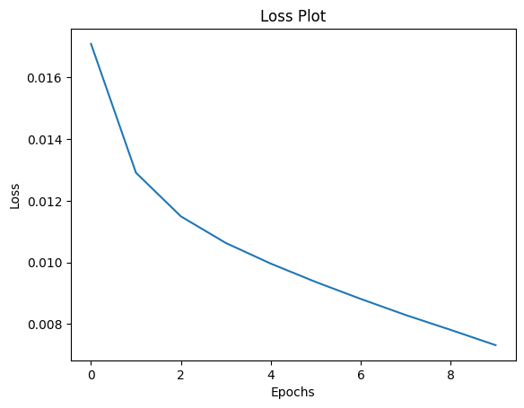
    


```python
# checkpoint_dir = './image_caption_model'
# checkpoint_prefix = os.path.join(checkpoint_dir, "ckpt")
# checkpoint = tf.train.Checkpoint(
#                                  optimizer=optimizer,
#                                  encoder=encoder,
#                                  decoder=decoder,
#                                 )

# checkpoint.restore(tf.train.latest_checkpoint(checkpoint_dir))
```

8. Evaluating the model


```python
def evaluate_argmax_search(image):
    attention_plot = np.zeros((train_maximum_length, attention_features_shape))

    hidden = decoder.reset_state(batch_size=1)

    temp_input = tf.expand_dims(load_image_from_path(image)[0], 0)
    test_image_tensor = image_features_extract_model(temp_input)
    test_image_tensor = tf.reshape(test_image_tensor, (test_image_tensor.shape[0], -1, test_image_tensor.shape[3]))

    features = encoder(test_image_tensor)

    decoder_input = tf.expand_dims([train_tokenizer.word_index['<start>']], 0)
    result = ['<start>']

    for i in range(train_maximum_length):
        predictions, hidden, attention_weights = decoder(decoder_input, features, hidden)

        attention_plot[i] = tf.reshape(attention_weights, (-1, )).numpy()

        predicted_id = tf.argmax(predictions[0]).numpy()
        result.append(train_index_word[predicted_id])

        if train_index_word[predicted_id] == '<end>':
            return result, attention_plot

        decoder_input = tf.expand_dims([predicted_id], 0)

    attention_plot = attention_plot[:len(result), :]
    return result, attention_plot
```


```python
def evaluate_beam_search(image, beam_index=3):
    start = [train_tokenizer.word_index['<start>']]
    
    start_word = [[start, 0.0]]
    hidden = decoder.reset_state(batch_size=1)

    temp_input = tf.expand_dims(load_image_from_path(image)[0], 0)
    test_image_tensor = image_features_extract_model(temp_input)
    test_image_tensor = tf.reshape(test_image_tensor, (test_image_tensor.shape[0], -1, test_image_tensor.shape[3]))
    features = encoder(test_image_tensor)
    while len(start_word[0][0]) < train_maximum_length:
        temp = []
        for s in start_word:
            decoder_input = tf.expand_dims([s[0][-1]], 0)
            preds, hidden, _ = decoder(decoder_input, features, hidden)
            word_preds = np.argsort(preds[0])[-beam_index:]

            # Getting the top <beam_index>(n) predictions and creating a 
            # new list so as to put them via the model again
            for w in word_preds:
                next_cap, prob = s[0][:], s[1]
                next_cap.append(w)
                prob += preds[0][w]
                temp.append([next_cap, prob])
                    
        start_word = temp
        # Sorting according to the probabilities
        start_word = sorted(start_word, reverse=False, key=lambda l: l[1].numpy())
        # Getting the top words
        start_word = start_word[-beam_index:]
    
    start_word = start_word[-1][0]
    intermediate_caption = [train_index_word[i] for i in start_word]
    final_caption = []
    
    for i in intermediate_caption:
        if i != '<end>':
            final_caption.append(i)
        else:
            break
    final_caption.append('<end>')
    return final_caption
```

9. Greedy Search (Argmax) - Image Caption Generation
- Argmax Search is where the maximum value index(argmax) in the maximum_length (46 in this case) long predicted vector is extracted and appended to the result. This is done until we hit end_token or the maximum length of the caption.


```python
def plot_attention(image, result, attention_plot):
    try:
        temp_image = np.array(PIL.Image.open(image))

        fig = plt.figure(figsize=(10, 10))

        len_result = len(result)
        for l in range(len_result):
            temp_att = np.resize(attention_plot[l], (8, 8))
            ax = fig.add_subplot(len_result//2, len_result//2, l+1)
            ax.set_title(result[l])
            img = ax.imshow(temp_image)
            ax.imshow(temp_att, cmap='gray', alpha=0.6, extent=img.get_extent())

        plt.tight_layout()
        plt.show()
    except:
        plt.close()
        print('Cannot plot this prediction')

def evaulate_argmax():
    i = 0
    generated_captions_argmax = []
    for test_image, test_image_caption in zip(val_img_paths, val_img_captions):
        predicted_caption, attention_plot = evaluate_argmax_search(test_image)
        generated_captions_argmax.append(predicted_caption)
        if i < 5:
            print ('\nReal Caption:', test_image_caption)
            print ('Prediction Caption (Argmax):', ' '.join(predicted_caption))
            plot_attention(test_image, predicted_caption, attention_plot)
        i = i + 1
    return generated_captions_argmax

sess = tf.compat.v1.Session(config=tf.compat.v1.ConfigProto(log_device_placement=True))
generated_captions_argmax = []
if tf.config.list_physical_devices("GPU"):
    print("On GPU:")
    with tf.device("/device:GPU:0"):
        generated_captions_argmax = evaulate_argmax()
else:
    generated_captions_argmax = evaulate_argmax()
    
print(generated_captions_argmax[:5])
```

    Device mapping:
    /job:localhost/replica:0/task:0/device:GPU:0 -> device: 0, name: Tesla P100-PCIE-16GB, pci bus id: 0000:00:04.0, compute capability: 6.0
    
    On GPU:
    
    Real Caption: <start> A young man riding a skateboard down a street. <end>
    Prediction Caption (Argmax): <start> a man riding a skateboard down a road <end>


    
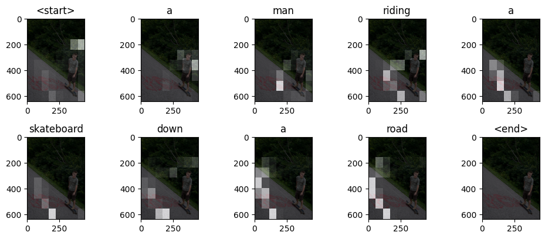
    


    
    Real Caption: <start> a close up of a cat on a desk near a sandwich  <end>
    Prediction Caption (Argmax): <start> a cat is sitting on a table <end>


    
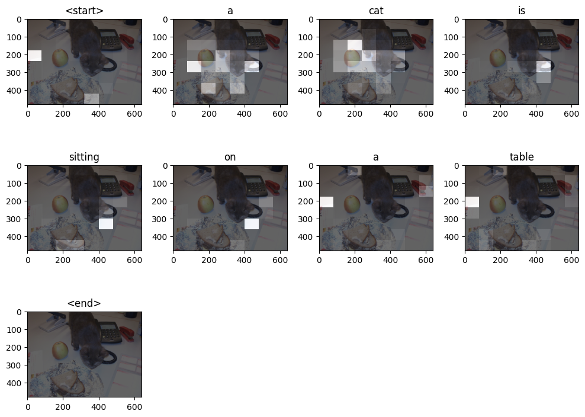
    


    
    Real Caption: <start> A silver hippy van and a bus for vegans. <end>
    Prediction Caption (Argmax): <start> a car parked in a parking lot <end>


    
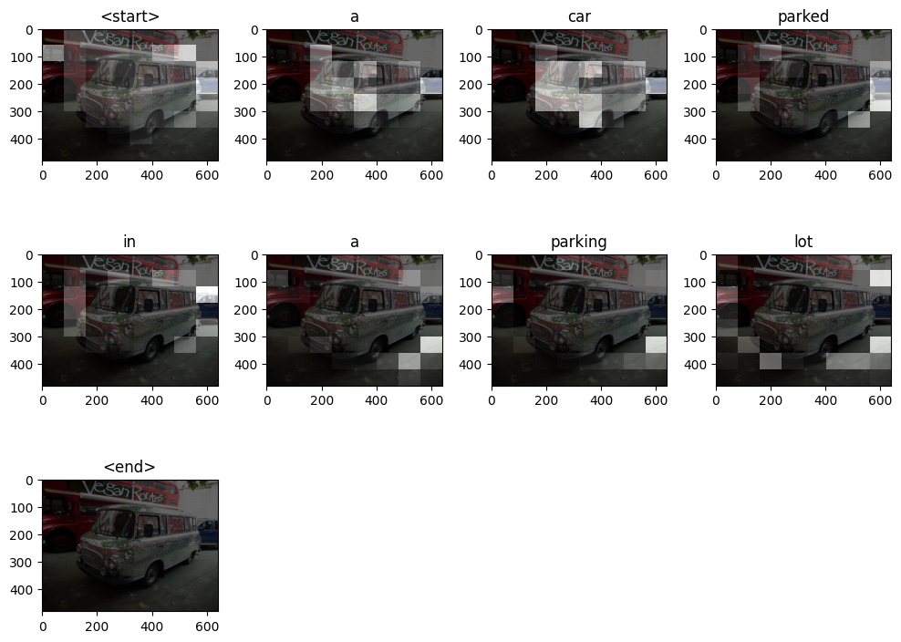
    


    
    Real Caption: <start> a red and gray bus stopped at the bus stop <end>
    Prediction Caption (Argmax): <start> a double decker bus on a street <end>


    
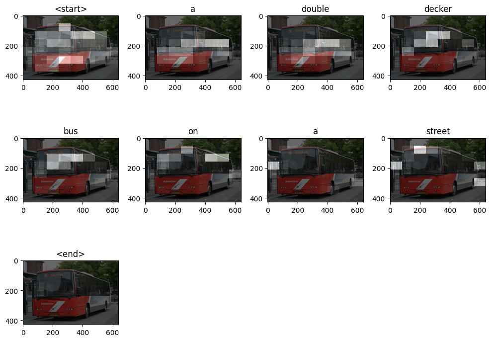
    


    
    Real Caption: <start> A plate of pasta in a bowl at a restaurant.  <end>
    Prediction Caption (Argmax): <start> a table with plates of food on a plate <end>


    
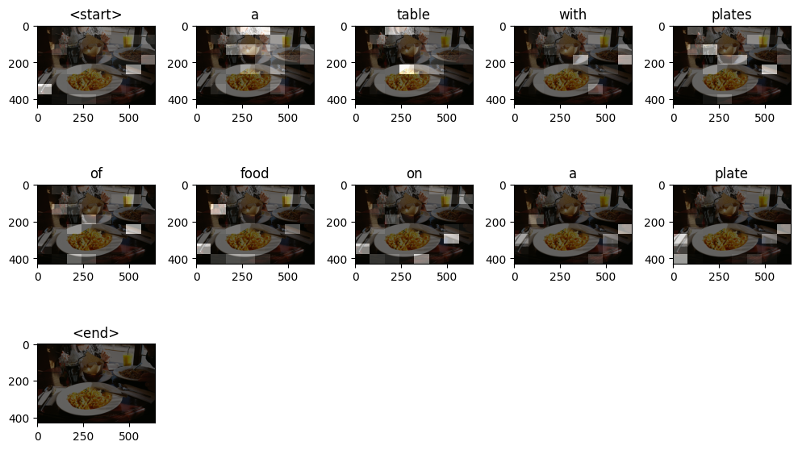
    


    [['<start>', 'a', 'man', 'riding', 'a', 'skateboard', 'down', 'a', 'road', '<end>'], ['<start>', 'a', 'cat', 'is', 'sitting', 'on', 'a', 'table', '<end>'], ['<start>', 'a', 'car', 'parked', 'in', 'a', 'parking', 'lot', '<end>'], ['<start>', 'a', 'double', 'decker', 'bus', 'on', 'a', 'street', '<end>'], ['<start>', 'a', 'table', 'with', 'plates', 'of', 'food', 'on', 'a', 'plate', '<end>']]


10. Beam Search - Image Caption Generation
- We take top k predictions (i.e. beam_index - 3 in this case), feed them again in the model and then sort them using the probabilities returned by the model. So, the list will always contain the top k predictions. In the end, we take the one with the highest probability and go through it till we encounter end_token or reach the maximum caption length.


```python
def evaluate_beam():
    i = 0
    generated_captions_beam_search = []
    for test_image, test_image_caption in zip(val_img_paths, val_img_captions):
        predicted_caption = evaluate_beam_search(test_image, beam_index=3)
        generated_captions_beam_search.append(predicted_caption)
        if i < 5:
            print ('\nReal Caption:', test_image_caption)
            print ('Prediction Caption - Beam Search, width = 3:', ' '.join(predicted_caption))
            temp_image = np.array(PIL.Image.open(test_image))
            fig = plt.figure()
            ax = fig.add_subplot()
            ax.imshow(temp_image)
            plt.tight_layout()
            plt.show()
        i = i + 1
    return generated_captions_beam_search

sess = tf.compat.v1.Session(config=tf.compat.v1.ConfigProto(log_device_placement=True))
generated_captions_beam_search = []
if tf.config.list_physical_devices("GPU"):
    print("On GPU:")
    with tf.device("/device:GPU:0"):
        generated_captions_beam_search = evaluate_beam()
else:
    generated_captions_beam_search = evaluate_beam()

print(generated_captions_beam_search[:5])
```

    Device mapping:
    /job:localhost/replica:0/task:0/device:GPU:0 -> device: 0, name: Tesla P100-PCIE-16GB, pci bus id: 0000:00:04.0, compute capability: 6.0
    
    On GPU:
    
    Real Caption: <start> A young man riding a skateboard down a street. <end>
    Prediction Caption - Beam Search, width = 3: <start> a skateboard down a street <end>


    
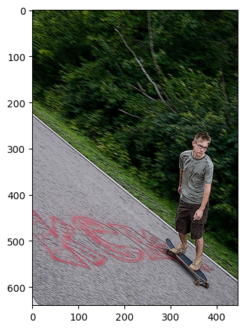
    


    
    Real Caption: <start> a close up of a cat on a desk near a sandwich  <end>
    Prediction Caption - Beam Search, width = 3: <start> a cat sitting next to a white plate <end>


    
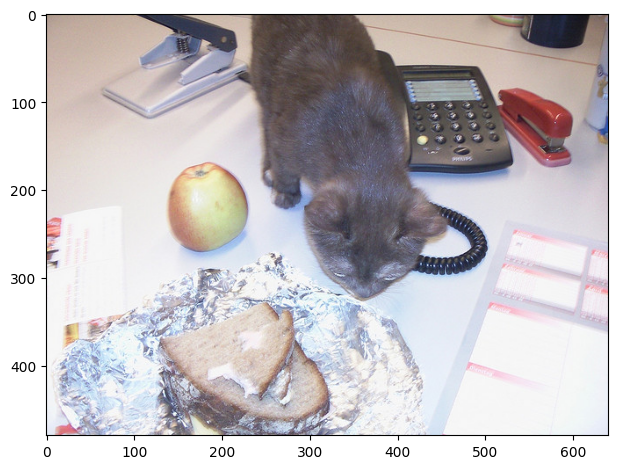
    


    
    Real Caption: <start> A silver hippy van and a bus for vegans. <end>
    Prediction Caption - Beam Search, width = 3: <start> an image of a parking lot <end>


    
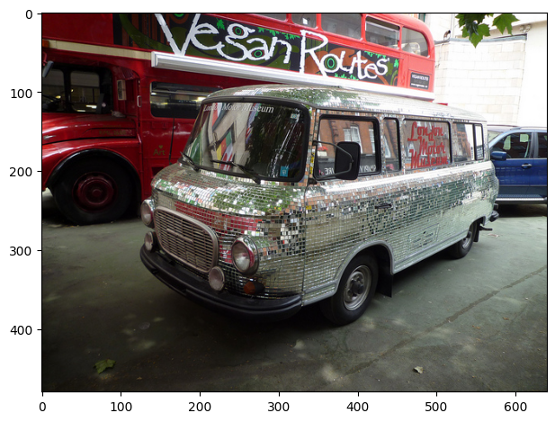
    


    
    Real Caption: <start> a red and gray bus stopped at the bus stop <end>
    Prediction Caption - Beam Search, width = 3: <start> a double decker feel with a street <end>


    
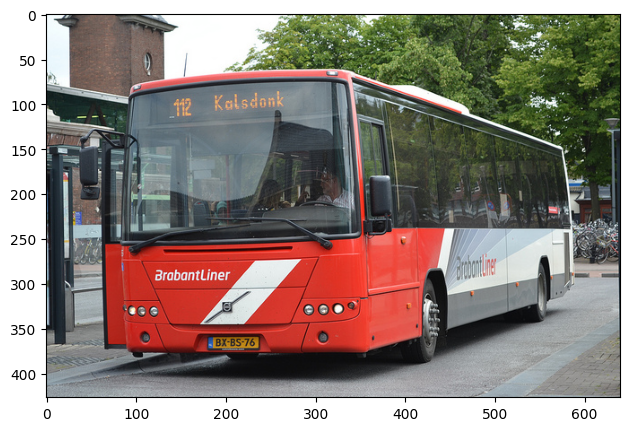
    


    
    Real Caption: <start> A plate of pasta in a bowl at a restaurant.  <end>
    Prediction Caption - Beam Search, width = 3: <start> a group of food on top of paper plate on a plate on top of paper plate on a plate on a plate on top of paper plate on a plate on a plate on top of paper plate on a plate on a plate on top of a plate <end>


    
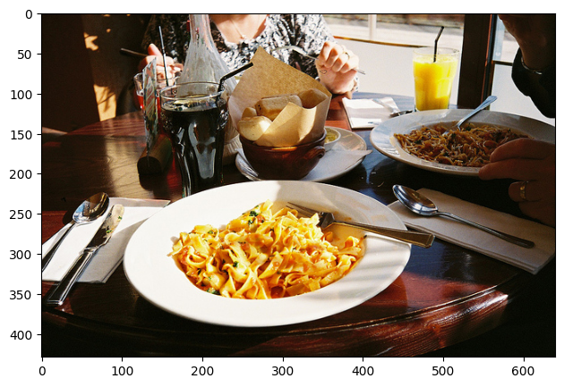
    


    [['<start>', 'a', 'skateboard', 'down', 'a', 'street', '<end>'], ['<start>', 'a', 'cat', 'sitting', 'next', 'to', 'a', 'white', 'plate', '<end>'], ['<start>', 'an', 'image', 'of', 'a', 'parking', 'lot', '<end>'], ['<start>', 'a', 'double', 'decker', 'feel', 'with', 'a', 'street', '<end>'], ['<start>', 'a', 'group', 'of', 'food', 'on', 'top', 'of', 'paper', 'plate', 'on', 'a', 'plate', 'on', 'top', 'of', 'paper', 'plate', 'on', 'a', 'plate', 'on', 'a', 'plate', 'on', 'top', 'of', 'paper', 'plate', 'on', 'a', 'plate', 'on', 'a', 'plate', 'on', 'top', 'of', 'paper', 'plate', 'on', 'a', 'plate', 'on', 'a', 'plate', 'on', 'top', 'of', 'a', 'plate', '<end>']]


```python
test_tokenizer, test_sequences, test_index_word, test_caption_vector, test_maximum_length = tokenize_captions(val_img_captions)
test_caption_tokens = []
for test_sequence in test_sequences:
    tokens = []
    for sequence in test_sequence:
        token = test_index_word[sequence]
        tokens.append(token)
    test_caption_tokens.append(tokens)

print(test_caption_tokens[:5])
```

    [['<start>', 'a', 'young', 'man', 'riding', 'a', 'skateboard', 'down', 'a', 'street', '<end>'], ['<start>', 'a', 'close', 'up', 'of', 'a', 'cat', 'on', 'a', 'desk', 'near', 'a', 'sandwich', '<end>'], ['<start>', 'a', 'silver', 'hippy', 'van', 'and', 'a', 'bus', 'for', 'vegans', '<end>'], ['<start>', 'a', 'red', 'and', 'gray', 'bus', 'stopped', 'at', 'the', 'bus', 'stop', '<end>'], ['<start>', 'a', 'plate', 'of', 'pasta', 'in', 'a', 'bowl', 'at', 'a', 'restaurant', '<end>']]


11. Comparing two image caption generation techniques

1.  ROUGE_L Score - The Rouge-L metric is a score from 0 to 1 indicating how similar two sequences are, based on the length of the longest common subsequence (LCS)
- Greedy Search performed better than Beam Search as F-Measure of each predicted caption by Greedy Search is larger than that of Beam Search
  <br>
  Ex: Real Caption: <b><start> A young man riding a skateboard down a street. <end></b>
    <br>
    Greedy Search prediction: <b><start> a man riding a skateboard down a road <end></b>  F-Measure: <b>0.8571428</b>
    <br>
    Beam Search prediction:<b><start> a skateboard down a street <end></b>  F-Measure: <b>0.7777778</b>


```python
hypotheses_argmax = tf.ragged.constant(generated_captions_argmax)
hypotheses_beam_search = tf.ragged.constant(generated_captions_beam_search)
references = tf.ragged.constant(test_caption_tokens)

result = text.metrics.rouge_l(hypotheses_argmax, references)
print('Argmax Evaluation')
print('F-Measure: %s' % result.f_measure)
print('P-Measure: %s' % result.p_measure)
print('R-Measure: %s' % result.r_measure)


result = text.metrics.rouge_l(hypotheses_beam_search, references)
print('\nBeam Search Evaluation')
print('F-Measure: %s' % result.f_measure)
print('P-Measure: %s' % result.p_measure)
print('R-Measure: %s' % result.r_measure)
```

    Argmax Evaluation
    F-Measure: tf.Tensor([0.8571428  0.5217392  0.4        ... 0.0597015  0.38095242 0.46153846], shape=(1600,), dtype=float32)
    P-Measure: tf.Tensor([0.9        0.6666667  0.44444445 ... 0.03846154 0.4        0.42857143], shape=(1600,), dtype=float32)
    R-Measure: tf.Tensor([0.8181818  0.42857143 0.36363637 ... 0.13333334 0.36363637 0.5       ], shape=(1600,), dtype=float32)
    
    Beam Search Evaluation
    F-Measure: tf.Tensor([0.7777778  0.4166667  0.3157895  ... 0.32000002 0.3157895  0.5       ], shape=(1600,), dtype=float32)
    P-Measure: tf.Tensor([1.    0.5   0.375 ... 0.4   0.375 0.625], shape=(1600,), dtype=float32)
    R-Measure: tf.Tensor([0.6363636  0.35714287 0.27272728 ... 0.26666668 0.27272728 0.41666666], shape=(1600,), dtype=float32)


2. BLUE Score
- Greedy Search performed better since it's BLUE score is higher than that of Beam Search


```python
from nltk.translate.bleu_score import corpus_bleu

references = [[tgt] for tgt in test_caption_tokens]  # bleu_score expects a list of lists

hypotheses_argmax = generated_captions_argmax
hypotheses_beam_search = generated_captions_beam_search

bleu_score_argmax = corpus_bleu(references, hypotheses_argmax)
bleu_score_beam_search = corpus_bleu(references, hypotheses_beam_search)

print(f"BLEU Score Argmax: {bleu_score_argmax}")
print(f"BLEU Score Beam Search: {bleu_score_beam_search}")
```

    BLEU Score Argmax: 0.0676884401616652
    BLEU Score Beam Search: 0.05296045883259241


3. METEOR Score
- Greedy Search performed better since it's METEOR score is higher than that of Beam Search


```python
from nltk.translate.meteor_score import meteor_score

def corpus_meteor(expected, predicted):
    meteor_score_sentences_list = list()
    [meteor_score_sentences_list.append(meteor_score(expect, predict)) for expect, predict in zip(expected, predicted)]
    meteor_score_res = np.mean(meteor_score_sentences_list)
    return meteor_score_res

hypotheses_argmax = generated_captions_argmax
hypotheses_beam_search = generated_captions_beam_search

meteor_score_argmax = corpus_meteor(references, hypotheses_argmax)
meteor_score_beam_search = corpus_meteor(references, hypotheses_beam_search)

print(f"METEOR Score Argmax: {meteor_score_argmax}")
print(f"METEOR Score Beam Search: {meteor_score_beam_search}")
```

    METEOR Score Argmax: 0.28793606370469343
    METEOR Score Beam Search: 0.23600360916996344


12. Conclusion
- It can be seen that Greedy Search (Argmax) generated image captions better than the Beam Search.
- Time taken by Greedy Search to generate image caption on 1600 test image was 5 mins. Whereas, beam search took 65 mins - this is because beam search considers top k (beam_index - 3 in this case) predictions and then generates next predictions for these top k previous predictions which is time consuming.
- Also on a manual look-up it can be seen that greedy search generated image captions are more human-likely compared to beam search.
- Since beam search explores multiple paths, it can produce more diverse and higher-quality results compared to greedy search. Surprisingly in this study, it can be seen that greedy search produced higher-quality results. The reason for this behavior is not limited to, but might include the effect of training the model on a smaller dataset, limiting the number of epochs to 10 due to resource constraints, and using a lower beam index of 3.

13. Future work
- Train on larger dataset to have model with improved generalization and reduced overfitting.
- Increasing epoch to higher number to reduced training error and improved learning of the model.
- Increase beam_index to 7 or 10 for beam search and then re-evaluate it's performance with greedy search.
